# 見動不孤單 探索漸凍旅途

## 說明
  
此作品用 Nuxt 開發，讓 ALS 患者及家屬了解自身病程並提供協助，前臺頁面包括概念首頁、自我檢測、註冊登入、文章影片專區、資訊內容數頁，後臺供管理者新增、編輯、刪除文章專區。
  
### 作品網址
  
未正式上線，暫不提供
  

### 功能說明
#### 前台
* Nuxt3 框架
* 使用 Bootstrap5 切版
* 套用 AOS 動畫
* Pinia 狀態管理工具
* 串接後端 API
* GSAP 製作動畫
* SEO 優化

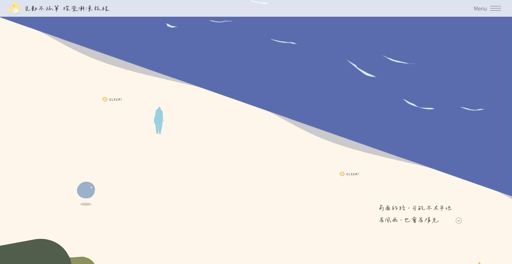
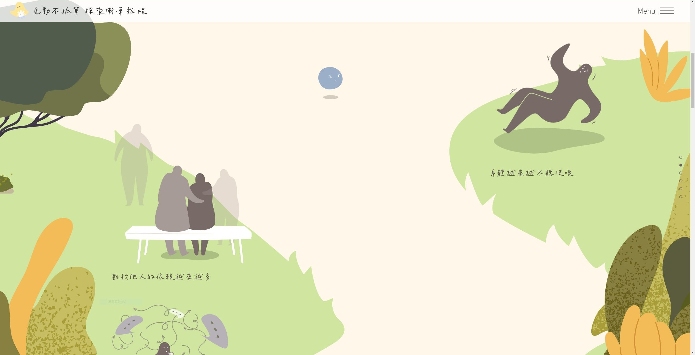
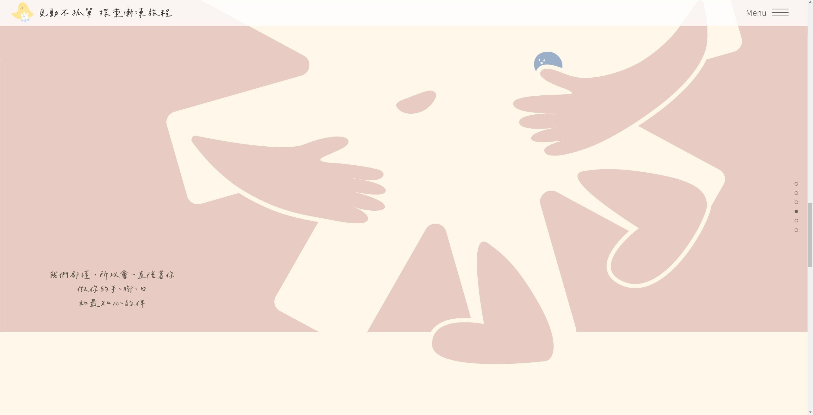
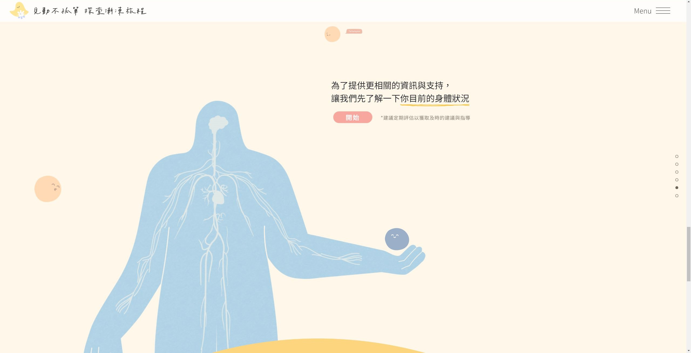
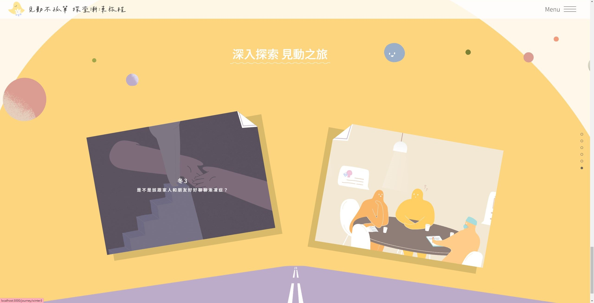
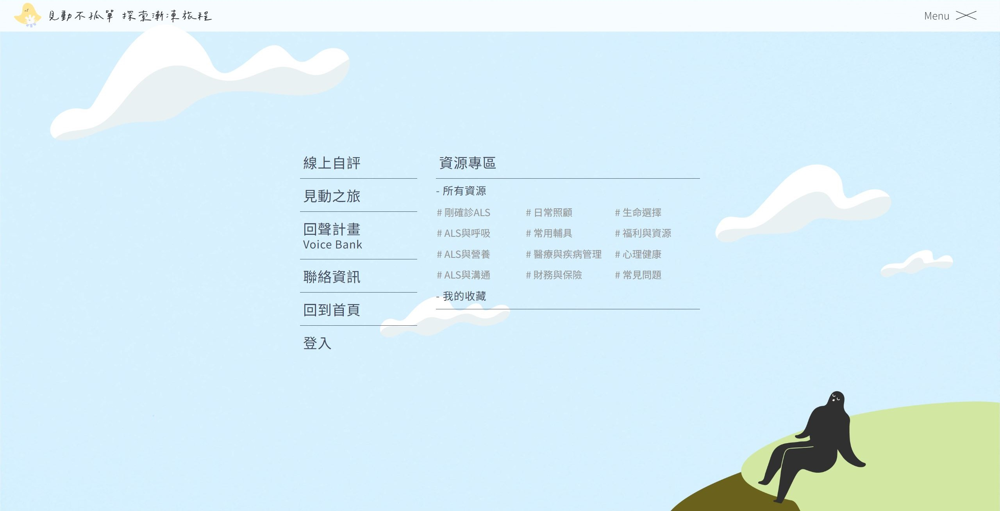
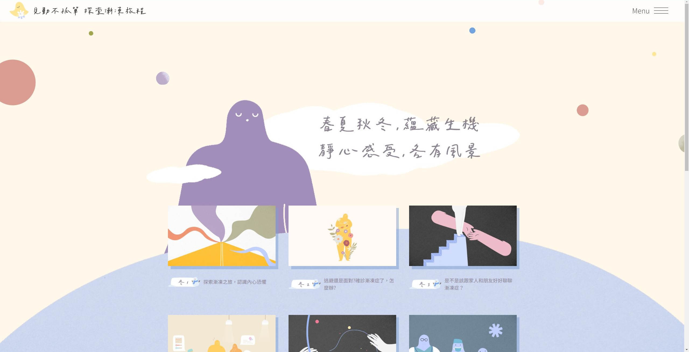
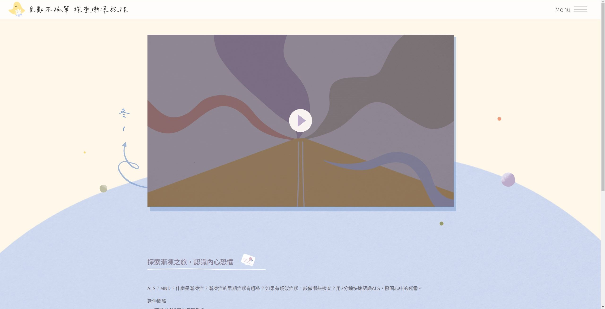
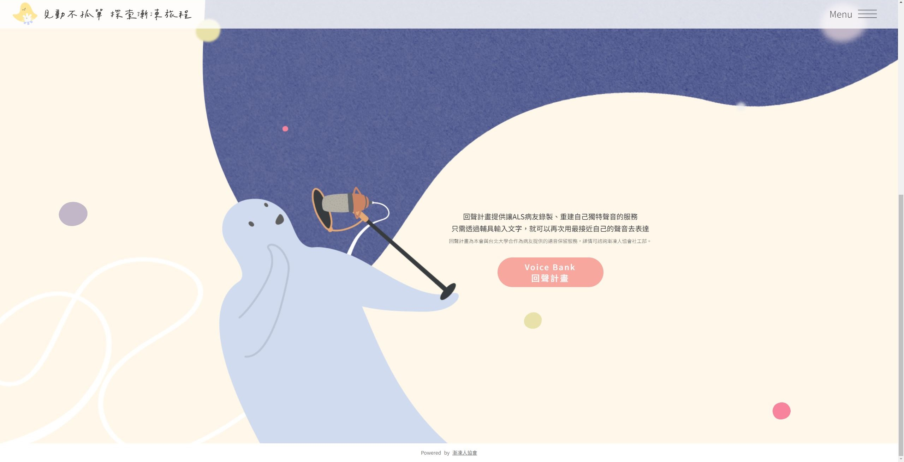
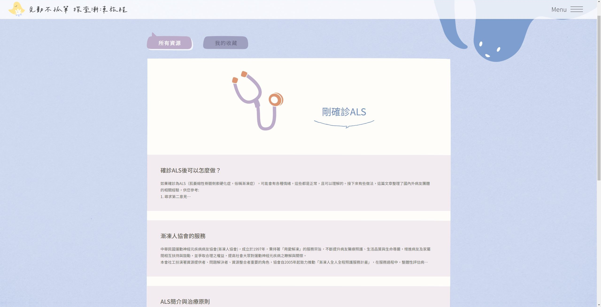
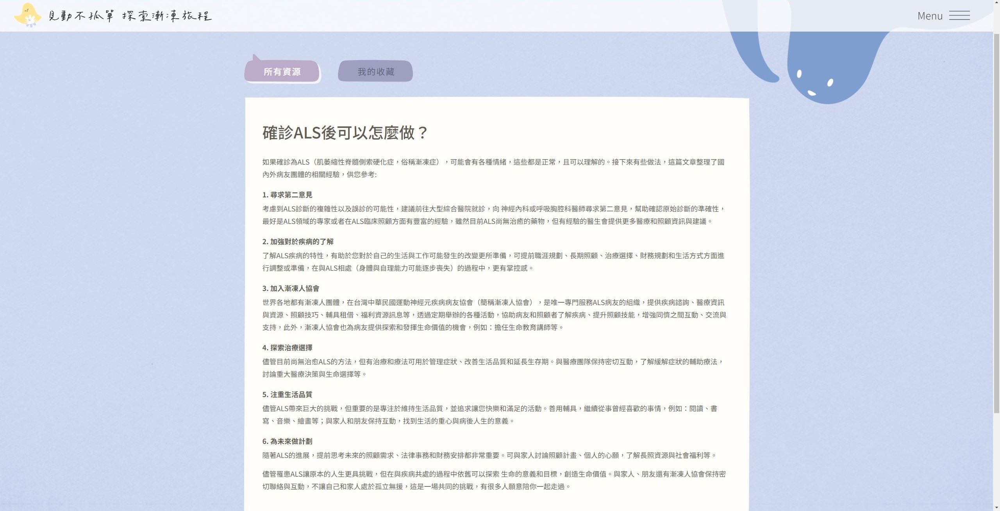
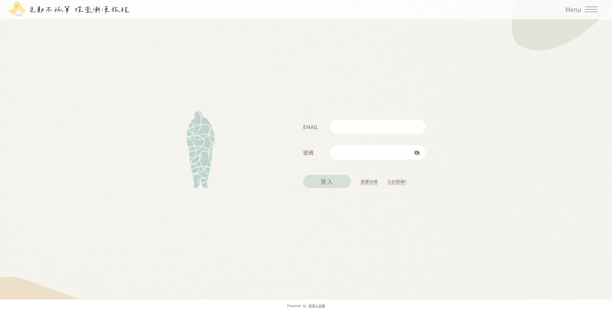
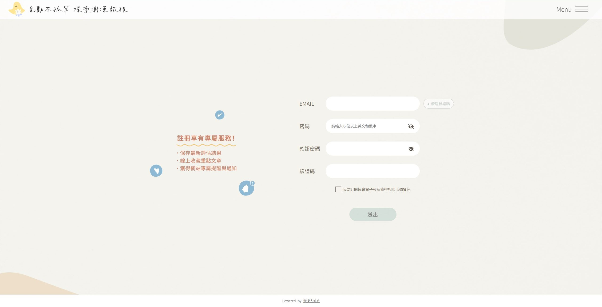
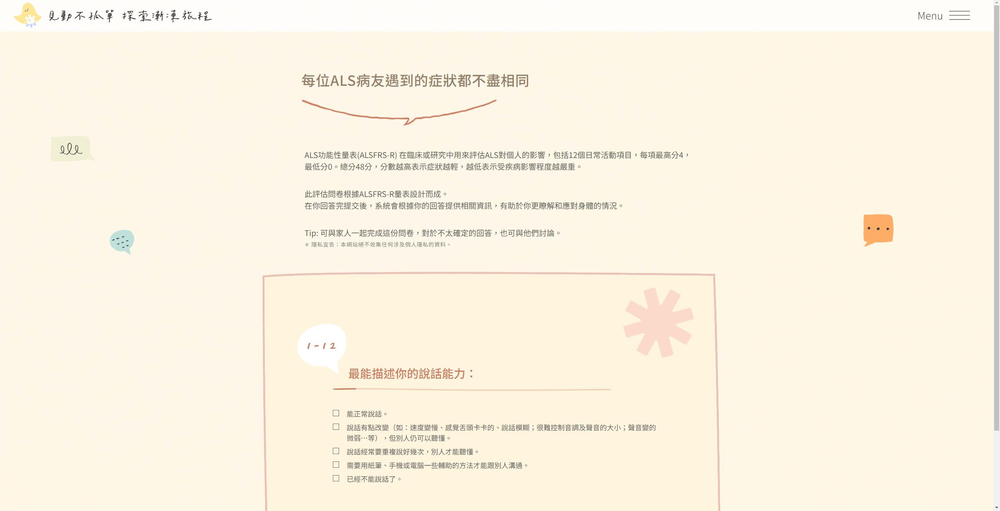
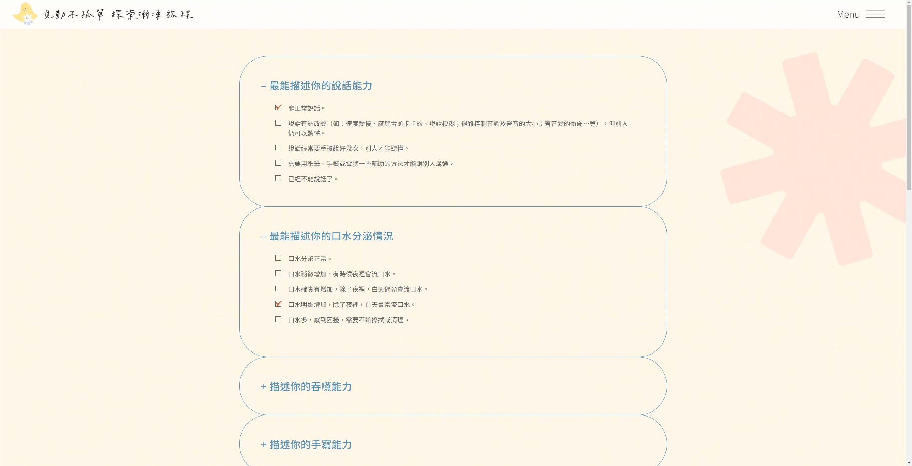

#### 後台
* 登入驗證
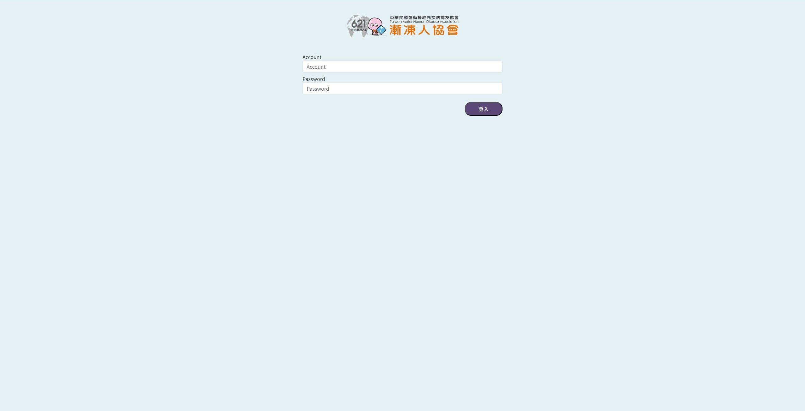
* 會員資料、匯出
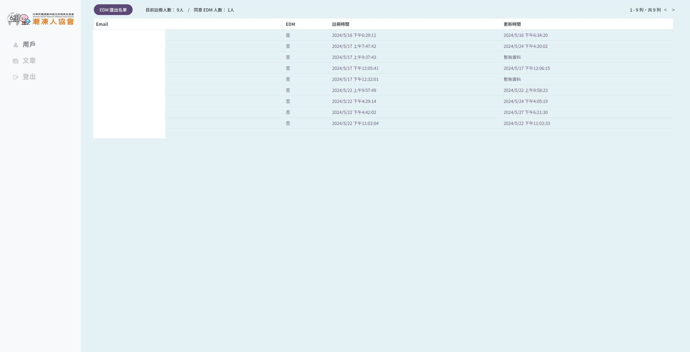
* 新增、編輯文章
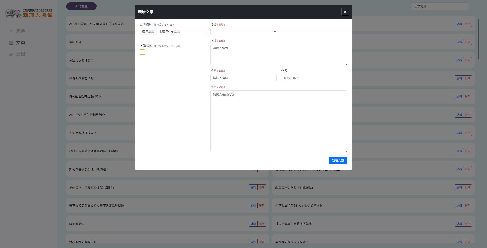